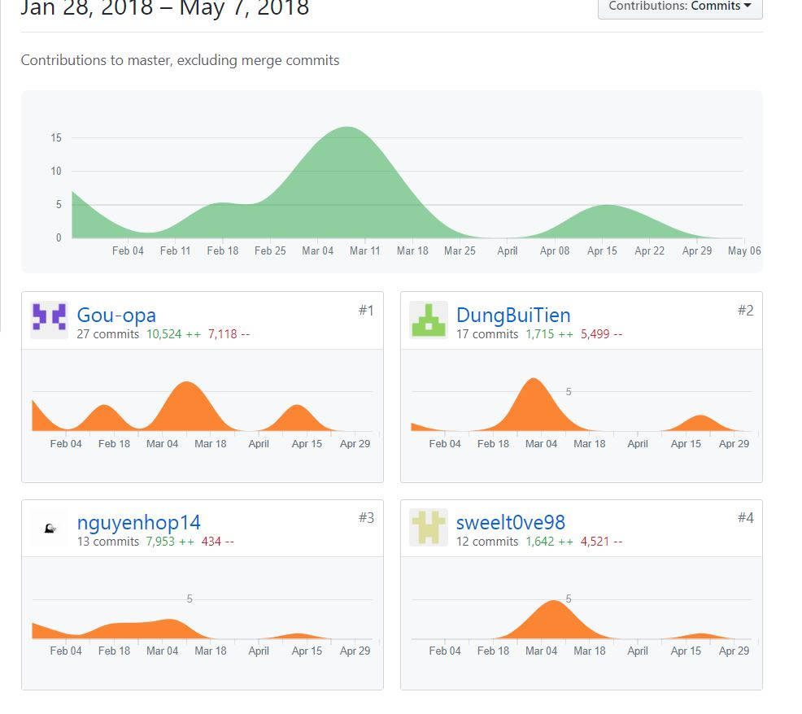
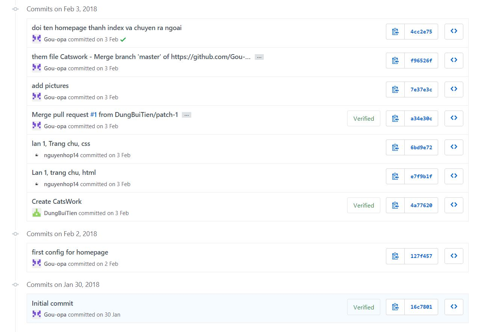
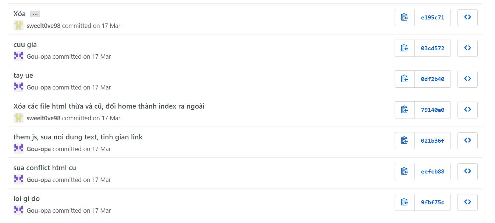
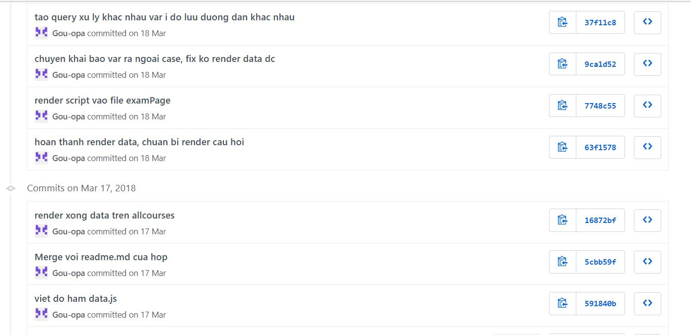
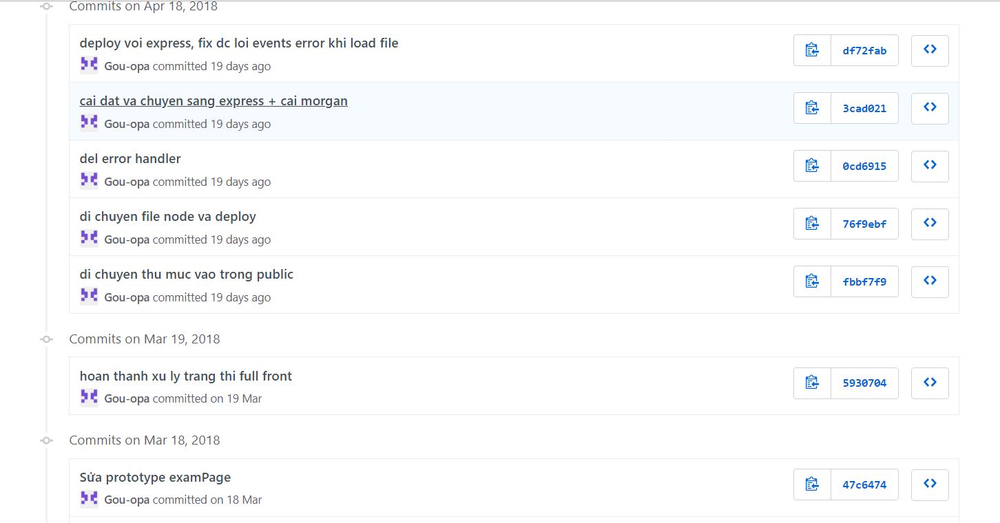
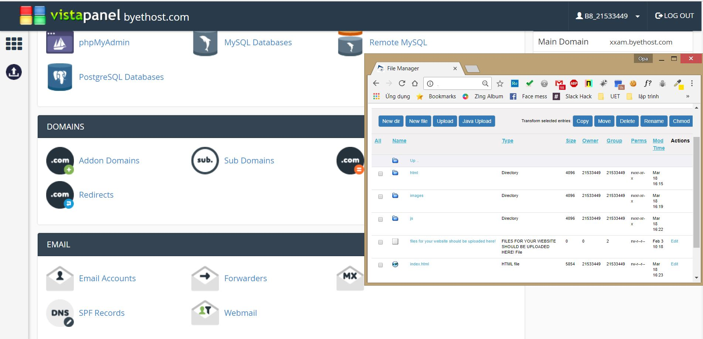
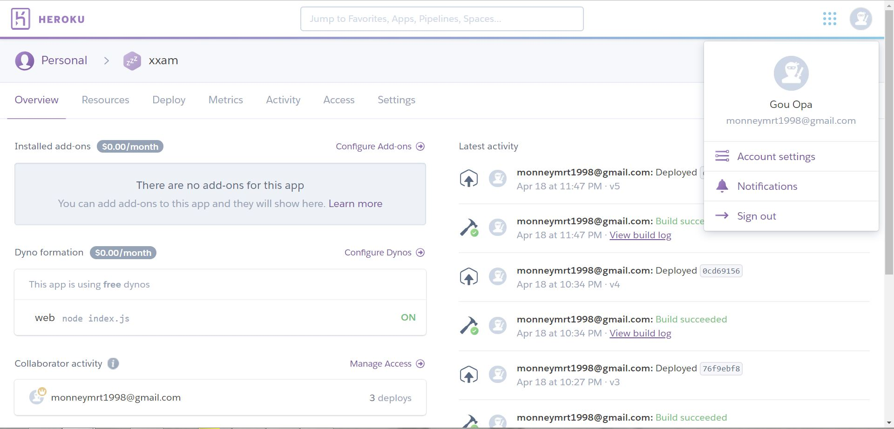

## Báo cáo cá nhân tổng kết môn học:
Lớp học phần INT2208-2-2018
 Công nghệ phần mềm - 2018 

Giảng viên: PGS.TS Trương Anh Hoàng
-----------------------------------------
## Sinh viên [Nguyễn Ngọc Tiến](https://github.com/truonganhhoang/INT2208-2-2018/tree/master/NguyenNgocTien) 
MSV: 16021345

Nội dung đã thực hiện được:
> Các minh chứng cụ thể hơn nằm trong thư mục tiến độ của mỗi khóa học
1. Các khoá học cá nhân:
	* [Git&Github](./How-to-use-version-control-in-git-and-github/): 100%
	* [CSS](./CSS3/): 25%
	* [HTML](./HTML5/): 100%
	* [Javascript](./Javascript/): 100%
	* [Introduction SE](./Introduction-to-software-engineering/): 100%
2. Bài tập trung tuần:
Hoàn thiện giao diện bài tập lớn và đưa vào một bộ dữ liệu cá nhân để hiển thị
Nội dung hoàn thiện tương đồng với phần việc thực hiện trong bài tập lớn (trình bày ở dưới đây)
> Nội dung bài tập tuần 6 tại [đây](./Bai-tap-tuan-6/)
3. Bài tập lớn:
Nội dung phần cài đặt và nộp tiến độ của nhóm tại repository [Gou-opa/exam-portal](https://github.com/Gou-opa/exam-portal)

Các bước tham gia:
	* Tham gia lên ý tưởng và phản biện tính khả thi của các đề tải để nhóm cân nhắc thực hiện: Web quảng cáo sản phẩm dựa theo mô hình Lazada, Cổng thi trực tuyến dựa trên mô hình cổng thi nội bộ của trường.
	* Phân chia nhiệm vụ, cân đối dung lượng công việc cho các thành viên
	* Tham gia thiết kế giao diện homepage và course page

	* Tổ chức họp nhóm trực tuyến hàng ngày lúc 20h30 theo quy trình Scrum
	* Thử thêm chức năng đăng nhập bằng Facebook vào dự án nhưng không thành công (file đã bị loại bỏ khỏi kết quả bài nộp nên không có dẫn chứng)
	* Thực hiện lập trình và kiểm thử toàn bộ [Javascript](./../nhom-4.0/exam-portal/public/js) cho dự án: Đưa template giao diện vào code render, bộ đếm giờ, xử lý bài làm và trả điểm.

	* Thực hiện lập trình và kiểm thử toàn bộ [NodeJS](./../nhom-4.0/exam-portal/) cho dự án

	* Triển khai giao diện tĩnh ứng dụng trên [xxam.ml](http://xxam.ml/?i=1) qua hosting miễn phí Byethost.com và kiểm thử

	* Triển khai [web server](https://xxam.herokuapp.com/)  NodeJS trên hosting miễn phí Heroku và kiểm thử

	* Viết chương 5 Triển khai và đánh giá, cụ thể gồm 5.1. của [tài liệu dự án](https://goo.gl/cGdKdp)

	Tóm lại, qua môn học này, em đã thu lượm được rất nhiều kiến thức trong phát triển phần mềm, nâng tầm quan trọng của quá trình (process) trong nhận thức về phát triển phần mềm. Hiểu biết thêm và tuân thủ quy trình phần mềm, giúp nâng cao hiệu suất làm việc cùng với kỹ năng làm việc nhóm. Làm phần mềm không chỉ là code, mà còn là mối quan hệ giữa những người liên quan và giá trị của sản phẩm.
	
	
 +- Người chấm: Nguyễn Mạnh Tiến.
 +- Điểm: 10.
 +- Nhận xét: Hoàn thành tốt các khoá học yêu cầu, có tìm hiểu các khoá học tự chọn, có sản phẩm demo các khoá học tự chọn, tham gia tích cực các hoạt động nhóm.
